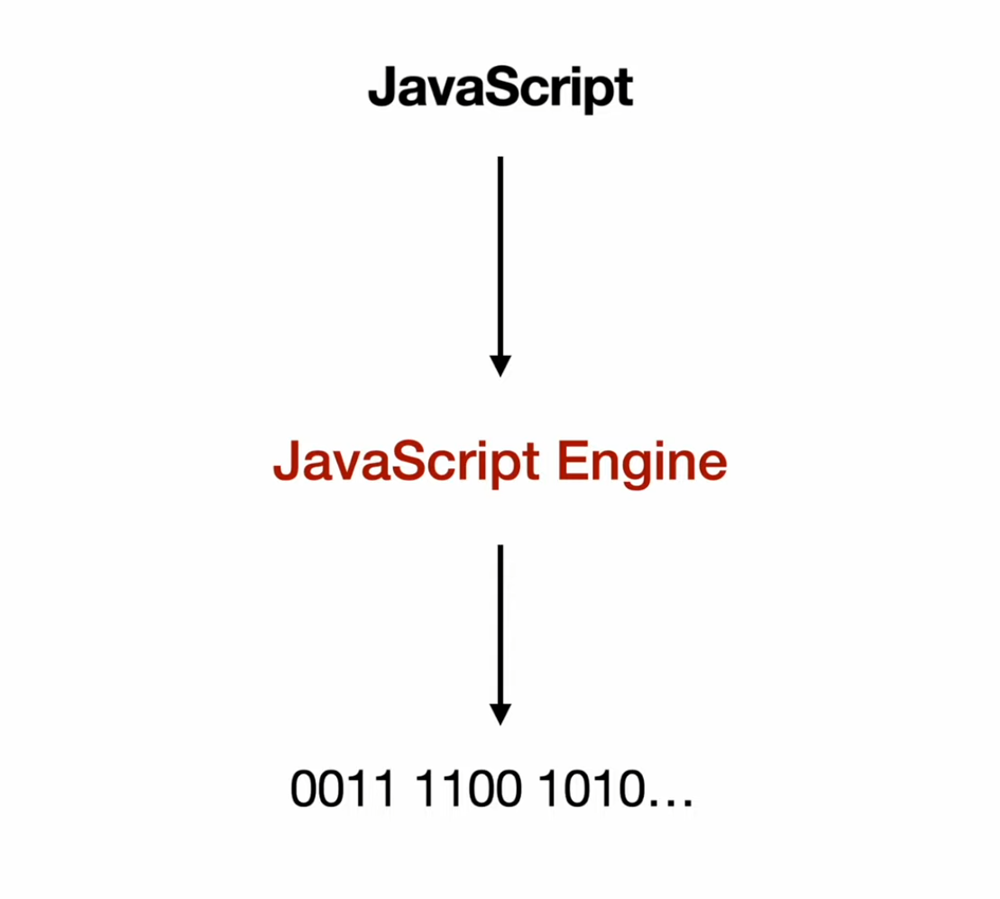

# V8

V8 is Google’s open source high-performance JavaScript and WebAssembly engine, written in C++. It is used in Chrome and in Node.js, among others.

V8 implements [ECMAScript](docs/ECMA-262_15th_edition_june_2024.pdf) and WebAssembly, and runs on Windows, macOS, and Linux systems that use x64, IA-32, or ARM processors. Additional systems (IBM i, AIX) and processors (MIPS, ppcle64, s390x) are externally maintained, see ports. V8 can be embedded into any C++ application.

V8 compiles and executes JavaScript source code, handles memory allocation for objects, and garbage collects objects it no longer needs. V8’s stop-the-world, generational, accurate garbage collector is one of the keys to V8’s performance.

JavaScript is commonly used for client-side scripting in a browser, being used to manipulate Document Object Model (DOM) objects for example. The DOM is not, however, typically provided by the JavaScript engine but instead by a browser. The same is true of V8 — Google Chrome provides the DOM. V8 does however provide all the data types, operators, objects and functions specified in the ECMA standard.

V8 enables any C++ application to expose its own objects and functions to JavaScript code. It’s up to you to decide on the objects and functions you would like to expose to JavaScript.

[**V8 - GitHUB**](https://github.com/v8/v8)
